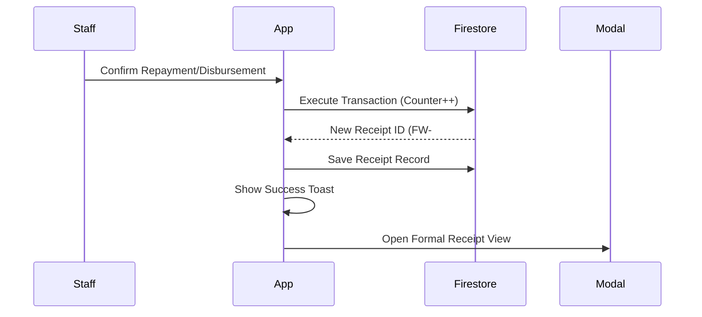

# Implementation Plan - Receipt Generation Module

Implement a formal, sequential receipt generation system for disbursements and repayments to ensure transparency and audit compliance.

## User Review Required

> [!IMPORTANT]
> **Sequential Numbering Architecture**: I will implement a Firestore transaction-based counter system. This ensures that IDs like `FW-DIS-20260420-0001` are never duplicated, even with concurrent transactions.
>
> **PDF Generation**: Since no PDF library is currently installed, I will implement high-fidelity **CSS @media print** styles. This allows users to "Print to PDF" with perfect styling while keeping the application bundle lightweight and fast.

## Proposed Changes

### Core Logic & Data Structure

#### [MODIFY] [App.tsx](file:///c:/Users/DESIRE%20BROWN/Downloads/fastkwacha/src/App.tsx)
- Update `ReceiptRecord` interface to include granular allocation fields (`penalty`, `interest`, `principal`, `remainingBalance`) and net disbursement tracking (`feesDeducted`, `netAmountSent`).
- Implement `getNextReceiptNumber(type: 'DIS' | 'REP')` using a Firestore transaction on a `counters` collection.
- Refactor `generateReceipt` to handle the new numbering system and granular data.
- Update `confirmRepayment` (and the verification handler) to calculate exact allocation amounts and pass them to the receipt generator.
- Update `handleManualDisbursement` to calculate fees and pass disbursement-specific fields.

### UI Components

#### [MODIFY] [App.tsx](file:///c:/Users/DESIRE%20BROWN/Downloads/fastkwacha/src/App.tsx)
- **ReceiptViewerModal**: Restyle into a highly formalized, "premium bank receipt" look (vibrant typography, subtle textures, official headers).
- **ClientDashboardView**: 
    - Add a "Receipts" tab to the dashboard.
    - Implement a searchable/filterable list of all receipts issued to the client.
    - Add "View Details" and "Print/PDF" actions for each receipt.

## Open Questions
1. **Daily Reset**: Should the sequential number (e.g., `-0001`) reset every day, or should it be a global incrementing counter (e.g., total receipts ever)? (The spec mentions `YYYYMMDD-####`, which usually implies a daily reset).
2. **Fee Calculation**: For disbursement receipts, should the `feesDeducted` be based on a fixed percentage or pulled from the specific loan product's charges?

## Verification Plan

### Automated Tests
- Trigger multiple concurrent repayments to verify that receipt numbers are sequential and unique (atomic transaction check).
- Verify that `remainingBalance` on the receipt matches the loan's outstanding balance after payment.

### Manual Verification
- Log in as a Client and verify the "Receipts" tab shows the new formal receipts.
- Open a receipt and trigger the "Print" action; verify the layout is perfectly formatted for A4 PDF.

